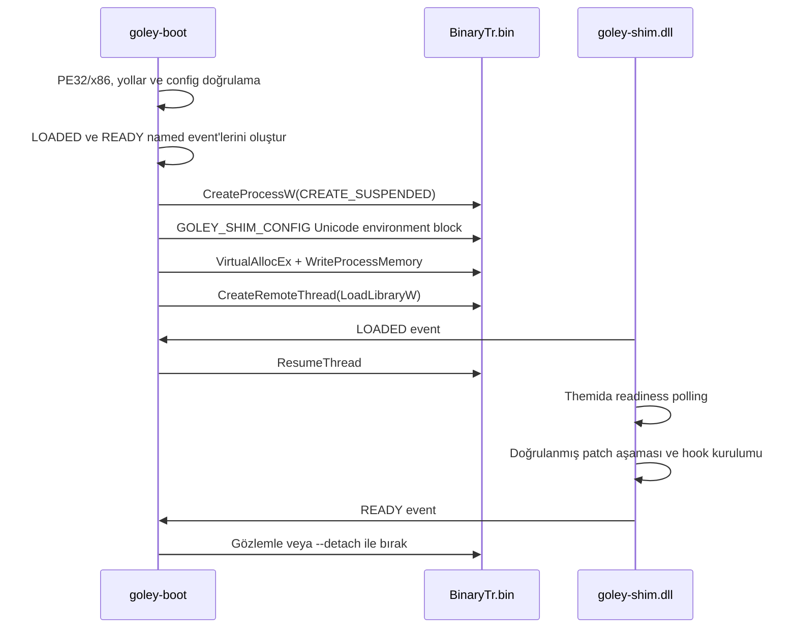

# Goley Windows istemcisi başlatma zinciri

## Amaç ve sınır

Bu akışın hedefi sabit 32-bit Goley istemcisinin kendi login ekranını çizmesini
sağlamaktır. Login/auth yanıtı üretilmez, offline oturum oluşturulmaz ve
istemciye sahte sunucu cevabı verilmez.

`goley-boot`, çalışmayan launcher/patch katmanı yerine ölçülmüş oyun görüntüsünü
doğrudan başlatır:

```text
"C:\Joygame\Goley\BinaryTr\BinaryTr.bin" TRAuth NoPopup
```

`run` ve `capture-waits` için ölçülmüş launcher anahtarı
`--runparam-key TOKEN` ile verilebilir. Bu seçenek child komut satırını
`"CLIENT" REGION TOKEN` biçiminde kurar; seçenek verilmezse yukarıdaki
`NoPopup` davranışı birebir korunur. `dump-unpacked` bu seçenekten etkilenmez.

```powershell
& "<ProjectRoot>\target\i686-pc-windows-msvc\release\goley-boot.exe" run `
  --client "C:\Joygame\Goley\BinaryTr\BinaryTr.bin" `
  --region TRAuth `
  --runparam-key TOKEN `
  --oep-rva 0x009374DB `
  --late-inject-ms 3000 `
  --shim "<ProjectRoot>\target\i686-pc-windows-msvc\release\goley_shim.dll" `
  --patches "<ProjectRoot>\crates\goley-shim\patches\patches.toml"
```

Login'e ulaşan ölçülmüş `TOKEN`, eşleşen `NMRunEnv_*` zarfı, tam komut ve
ekran kanıtı için
[`evidence/2026-08-16-login-reached.md`](evidence/2026-08-16-login-reached.md)
dosyasına bakın. `--oep-rva` adı bu adresin gerçek OEP olduğu iddiası değildir;
burada yalnız patch readiness gözlem noktası olarak kullanılmıştır.

`--entry 127.0.0.1:PORT`, yalnız `netredirect` özelliğiyle derlenmiş shim'de
ölçülü eski entry hedefini yerel dinleyiciye yönlendirir. Seçenek verilmezse
hiçbir Winsock hook'u kurulmaz.

## Yerel fixture envanteri

İstemci dosyaları repoya eklenmez.

| Rol | Tam yol | Boyut | SHA-256 |
| --- | --- | ---: | --- |
| Eski launcher | `C:\Joygame\Goley\Goley.exe` | 2.691.792 | `A96DB4DC7CB5437AF42AEC5E2ACB2A975377C831C823B17B689F837F31910A82` |
| Themida-packed x86/TLS oyun istemcisi | `C:\Joygame\Goley\BinaryTr\BinaryTr.bin` | 8.311.504 | `C136E751905FBE60CF27A71D7D05FBDE7C0428484D577F3A0A56766C839EFCFA` |

Kurulumda özgün bir `Goley_.exe` yoktur. Araştırma hedefi
`BinaryTr\BinaryTr.bin` dosyasıdır. İkinci istemci build'i sağlanmadığı için
onun SHA-256/RVA bilgisi bilinmiyor ve tahmin edilmiyor.

## Derleme

Launcher ve DLL hedefi `i686-pc-windows-msvc` olmalıdır. 64-bit DLL, 32-bit
istemciye yüklenmez.

```powershell
Set-Location "<ProjectRoot>"
rustup target add i686-pc-windows-msvc
cargo build -p goley-boot -p goley-shim `
  --release --target i686-pc-windows-msvc
```

Ağ yakalama turu için shim ayrıca açıkça bu özellikle derlenir:

```powershell
cargo build -p goley-shim --release --features netredirect `
  --target i686-pc-windows-msvc
```

Son doğrulanan release çıktıları:

| Artifact | Tam yol | PE | SHA-256 |
| --- | --- | --- | --- |
| Launcher | `<ProjectRoot>\target\i686-pc-windows-msvc\release\goley-boot.exe` | PE32 / `0x014c` | `D9A3624AD94C5E04DCEF8CC93867AF3BDF761A56663B0C6E9B0100719333A98F` |
| Shim | `<ProjectRoot>\target\i686-pc-windows-msvc\release\goley_shim.dll` | PE32 / `0x014c` | `0F35DAE70A0ECE8D4D2AB117A9C0D4827FD1354BB2BA10B955B51EE3FE65DD23` |

`goley-boot.exe` bir `requireAdministrator` manifest'i taşır. Normal terminalden
başlatılırken UAC onayı gerekir; yükseltme yoksa Windows hata 740 döndürür.

## Injection akışı



DLL süreç askıdayken yüklenir, fakat istemci koduna yönelik hook'lar hemen
kurulmaz. Shim önce `LOADED` sinyali verir; ana thread bundan sonra devam eder.
Themida readiness kontrolü istemci çalışırken yapılır ve `READY` yalnız hook
kurulumu tamamlandıktan sonra sinyallenir. Böylece kör bir launcher sleep'i
yerine iki aşamalı handshake kullanılır.

## Themida readiness

Shim software breakpoint veya `0xCC` yazmaz.

1. Ölçülmüş `--oep-rva` verilmişse onu izler.
2. Verilmemişse PE header'daki packed entry RVA'yı açıkça fallback heuristic
   olarak kullanır.
3. Sayfanın committed/executable olduğunu `VirtualQuery` ile doğrular.
4. İlk byte `0xCC` değilken 16 byte'lık örneğin art arda sabit kalmasını bekler.
5. Readiness sonrası `--late-inject-ms` kadar yerleşme payı verir.

| Seçenek | Varsayılan |
| --- | ---: |
| `--unpack-poll-ms` | 5 ms |
| `--unpack-stable-samples` | 4 |
| `--late-inject-ms` | 8 ms |
| `--timeout` | 30 saniye |

Bu fixture için gerçek OEP henüz ölçülmedi. Gözlemde kullanılan packed entry
RVA `0x157f000`, gerçek OEP kanıtı değildir.

## Shim hook'ları

### Named kernel-object gözlemi

`retour` trampoline'leri `CreateEventW/A`, `OpenEventW/A`, `CreateMutexW/A`,
`OpenMutexW/A`, `WaitForSingleObject`, `WaitForMultipleObjects` ve
`CloseHandle` üzerine kurulur. Create/open hook'undan önce edinilmiş handle'lar
`NtQueryObject(ObjectNameInformation/ObjectTypeInformation)` ile çözülür.

Her kayıt ilk shim-dışı çağıranı `module+offset` biçiminde taşır.
`wait_enter`, original wait'ten önce senkron olarak diske yazılır;
`wait_return` dönüş sonucu ile ayrı kayıttır. Böylece sonsuz beklemede dahi son
kanıt kaybolmaz.

### GameGuard

Capture modunda hiçbir nesne sinyallenmez. Run modunda yalnız
`--gameguard-ready-event` ile verilen ad gerçekten bir `Event` create/open
hook'unda görülürse aynı handle'a `SetEvent` uygulanır. Mutex event gibi
sinyallenmez; kaynakta varsayılan GameGuard nesne adı yoktur.

### Exit guard

Şu self-termination yolları çağıran konumuyla loglanır ve bastırılır:

- `ExitProcess`
- mevcut süreci hedefleyen `TerminateProcess`
- mevcut süreci hedefleyen `NtTerminateProcess`
- `RtlExitUserProcess`

Başka süreci hedefleyen terminate çağrıları original fonksiyona aktarılır.
`ExitProcess` gibi `noreturn` beklenen bir çağrıdan dönmek, çağrı noktasının
ardında geçerli devam yolu yoksa yalnız teşhis sağlar; client'ın ilerleyeceğini
garanti etmez. Gerçek ölçümdeki `0x80000003` blocker bunun örneğidir.

### Entry network redirect

Redirect iki kez default-off'tur: Cargo `netredirect` özelliği ve runtime
`--entry 127.0.0.1:PORT` seçeneği birlikte gerekir. `ws2_32!connect` ile
`ws2_32!WSAConnect` inline hook'ları yalnız ölçülmüş
`213.74.179.12:2270` hedefini verilen yerel dinleyiciye çevirir. Başka IP,
başka port, IPv6 ve tanınmayan sockaddr değerleri aynı pointer/uzunlukla
Winsock'a aktarılır. `20260` veya başka bir port ölçülüp allowlist'e açıkça
eklenmeden yönlendirilmez.

Her eşleşme senkron JSONL'ye `network_connect_redirect` olarak; API, original
ve redirected destination, socket ve çağıran module/offset/address alanlarıyla
yazılır. Feature'sız build'e `--entry` verilmesi, loopback dışı hedef, port 0
ve run dışı mod fail-closed biçimde READY öncesi yapılandırma hatasıdır.

### Patch politikası

Patch verisi yalnız
`<ProjectRoot>\crates\goley-shim\patches\patches.toml`
içinde `{ rva, original_bytes, patched_bytes, note, build_sha256 }` biçiminde
yaşar. Shim tam dosya SHA-256'sını ve tüm original byte'ları doğrulamadan hiçbir
şey yazmaz. Manifestte yalnız 2026-08-16'da ölçülen, build-hash'e bağlı
GameGuard 380 uyumluluk kaydı vardır; doğrulanmış dal/RVA/original byte kanıtı
olmadan başka patch eklenmez.

## Gerçek wait capture — 2026-08-16 00:23 TRT

Komut:

```powershell
$Root = "<ProjectRoot>"
$RawLog = Join-Path $env:TEMP "goley-capture-2026-08-16.jsonl"

Start-Process -Verb RunAs -Wait `
  -FilePath "$Root\target\i686-pc-windows-msvc\release\goley-boot.exe" `
  -WorkingDirectory $Root `
  -ArgumentList @(
    "capture-waits",
    "--client", "C:\Joygame\Goley\BinaryTr\BinaryTr.bin",
    "--region", "TRAuth",
    "--shim", "$Root\target\i686-pc-windows-msvc\release\goley_shim.dll",
    "--patches", "$Root\crates\goley-shim\patches\patches.toml",
    "--timeout", "30",
    "--report", "$Root\docs\runtime\evidence\2026-08-16-wait-handles.md",
    "--log", $RawLog,
    "-vv"
  )
```

Normalize rapor:

`<ProjectRoot>\docs\runtime\evidence\2026-08-16-wait-handles.md`

Client SHA-256:
`C136E751905FBE60CF27A71D7D05FBDE7C0428484D577F3A0A56766C839EFCFA`.

Kesin client nesneleri:

| Nesne | Tür/işlem | Çağıran | Timeout | Sonuç |
| --- | --- | --- | ---: | --- |
| `NL59NPGL` | Mutex create | `BinaryTr.bin+0x4e433d`, `+0x4e4b07` | — | oluşturuldu |
| `Global\MtxNPGL` | Mutex create/wait | create `+0x4e77a4`, wait `+0x4e7826` | 9500 ms | `WAIT_OBJECT_0` (`0`), bloklamadı |
| `Global\MtxNPGM` | Mutex create | `BinaryTr.bin+0x4e78c4` | — | oluşturuldu; wait görülmedi |

`d3d9.dll` kaynaklı `SM0:...:WilStaging_02_p0` semaphore ve
`windhawk.dll` kaynaklı `WindhawkSession...` mutexleri ortam gürültüsüdür;
GameGuard nesnesi olarak seçilmez.

Capture sırasında named `Event` görülmedi. Dolayısıyla kanıtlanmış bir
GameGuard ready-event adı yoktur ve `--gameguard-ready-event` verilmedi.
Normalize capture ayrıca `ExitProcess` için `BinaryTr.bin+0x4ba17d`,
`TerminateProcess` için `BugTrap.dll+0x10dc0` ve `NtTerminateProcess` için
`ntdll.dll+0x6e1e0` çağrılarını ayrı termination tablosuna kaydetti.

## Normal run ve kesin blocker — 2026-08-16 00:13 TRT

Aynı hashli client `run --region TRAuth` ile, ready-event adı uydurulmadan
başlatıldı. Shim iki aşamalı handshake'i tamamladı, sıfır statik patch uyguladı
ve ağ yönlendirmesini kapalı tuttu. Login window title/class oluşmadı.

Son kesin zincir:

1. `Global\MtxNPGL` beklemesi 9500 ms timeout istemesine rağmen anında
   `WAIT_OBJECT_0` döndü; bu wait blocker değildir.
2. `Global\MtxNPGM` oluşturuldu, fakat named ready Event açılmadı/oluşturulmadı.
3. Client `ExitProcess(0)` çağırdı. Exitguard'ın ölçtüğü dönüş konumu
   `BinaryTr.bin+0x4ba17d` idi.
4. BugTrap, mevcut sürece `TerminateProcess(..., 0xffffffff)` çağırdı;
   çağıran `BugTrap.dll+0x10dc0` idi.
5. Windows Application Error 1000 kaydı `BinaryTr.bin` için exception
   `0x80000003`, fault offset `0x004ba17d` bildirdi. Bu offset, ExitProcess
   çağrısının ölçülen dönüş konumuyla aynıdır.

Kesin blocker: GameGuard mutex kurulumundan sonra client'ın
`BinaryTr.bin+0x4ba17d` kontrol yolunda kendini sonlandırması ve exit
bastırılınca aynı noktada breakpoint exception ile çökmesi. Bu kontrolün hangi
predicate'i başarısız saydığı henüz bilinmiyor; hazır-event adı veya patch dalı
tahmin edilmedi.

Sonuç: **login ekranına ulaşılmadı**. Login/auth cevabı forge edilmedi, sahte
offline oturum açılmadı ve entry redirect etkinleştirilmedi.

## Doğrulama

```powershell
Set-Location "<ProjectRoot>"
$env:GOLEY_CLIENT_DIR = "C:\Joygame\Goley"

cargo fmt --all -- --check
cargo clippy --workspace --all-targets --all-features `
  --target i686-pc-windows-msvc -- -D warnings
cargo test --workspace --all-features --target i686-pc-windows-msvc
```

`GOLEY_CLIENT_DIR` ayarsızsa fixture testleri zarifçe atlanır. Mevcut runtime
testi seçilen client'ın PE32/x86 olduğunu doğrular. Login window assertion'ı,
login görünmediği için başarı iddiasında bulunmaz.

## Hâlâ kırılgan olanlar

1. Gerçek OEP ölçülmedi; packed PE entry fallback'i yalnız heuristic.
2. GameGuard ready Event adı yok; ölçülmeden seçilemez.
3. Bekleme yalnız GameMon child sürecindeyse client içindeki shim onu göremez.
4. `ExitProcess` bastırma teşhis amaçlıdır; `noreturn` çağrı noktasına güvenli
   devam yolu sağlamaz.
5. Tek patch kaydı yalnız SHA-256
   `C136E751905FBE60CF27A71D7D05FBDE7C0428484D577F3A0A56766C839EFCFA`
   build'ine ve RVA `0x009374DB`'ye bağlıdır; başka build'e taşınamaz.
6. `--entry` yalnız ölçülü `213.74.179.12:2270` rotasını kapsar; `20260` ve
   diğer rotalar ölçülmeden allowlist'e eklenmez.
7. İkinci istemci build'i için SHA/RVA verisi yoktur.
8. Login window class/title integration assertion'ı henüz yoktur.
